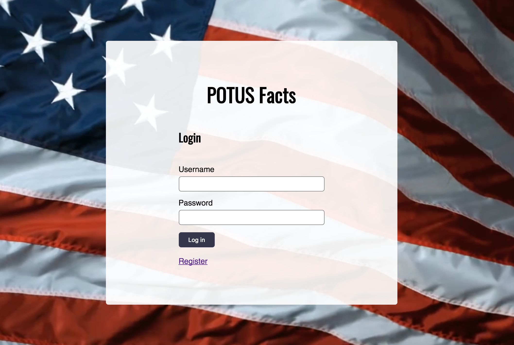
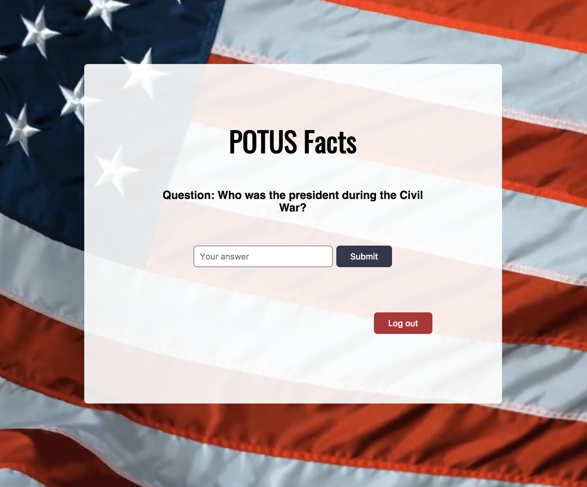

<h1 align="center">POTUS Facts</h1>
<p><em>This document provides general information on the POTUS Facts API backend.  For more information about the POTUS Facts client, please see <a href="https://github.com/bmalin92/presidents-cards-client">president-cards-client</a>.</em></p>

Why POTUS Facts
-------------
Are you a US history student? Maybe you just like presidential trivia. This application is for you! This application uses a spaced repition algorithm to sort presidential trivia questions. The more often you get a question correct, the less you see that question.  

How it Works
------------
<table layout="fixed">
  <tr>
    <td width="55%">
      <p>POTUS Facts keeps a custom set of trivia questions for each user. Create a user and sign in</p>
    </td>
    <td width = "40%">
      
    </td>
  </tr>
  <tr>
    <td width="55%">
      <p>The application will provide a question. Answer the question by filling in the input and clicking submit. The application will let you know if you got the question right or wrong. Click next to be given a new question.</p>
    </td>
    <td width = "40%">
      
    </td>
  </tr>
</table>

For local use
--------

```bash
# Clone repository
git clone https://github.com/bmalin92/president-cards-server

# Change directory
cd president-cards-server

# Install NPM dependencies
npm install

# Start the server
nodemon index
```
